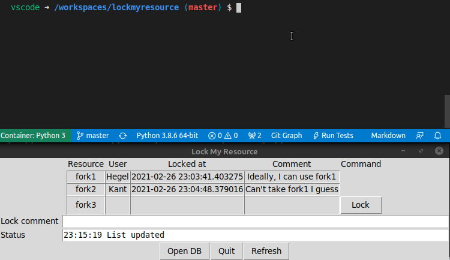

# lockmyresource
Coordinate locking resources for humans and machines, using a simple sqlite DB

There is a CLI for machines and admins and a minimal tk GUI for lock&release.

## TODO need a gif here


## Usage
```
usage: cli.py [-h] [--dbfile DBFILE] [--debug] {list,lock,release} ...

Lock some resources

positional arguments:
  {list,lock,release}  Commands
    list               List resources
    lock               Lock a resource
    release            Release a resource

optional arguments:
  -h, --help           show this help message and exit
  --dbfile DBFILE      Database to use
  --debug
```

> **NOTE** that the current user's username will be used for all operations.

### List resources
```
usage: cli.py list [-h] [--format {text,csv,json}]
```

#### Sample output
```
$ ./cli.py list
Resource User  Locked_at                  Comment
fork1    Hegel 2021-01-17 11:42:36.459921 Ideally, I can use fork1
fork2    Kant  2021-01-17 11:52:13.768924 Can't take fork1, I guess
spoon    None  None                       None
```

### Lock existing / Create new resource and lock it
```
usage: cli.py lock [-h] resource comment
```

>**NOTE** that the comment is mandatory.
>**NOTE** that deletion of resources is not yet implemented, you need to manipulate the sqlite DB manually for now

#### Example
```
$ ./cli.py lock fork1 'To eat or not to eat...'
Obtained lock for Resource(name='fork1')
```

### Release a lock
```
usage: cli.py release [-h] resource
```

>> **NOTE** That only the locking user can release a lock.

#### Example
```
$ ./cli.py release fork1
Released lock for Resource(name='fork1')
```
