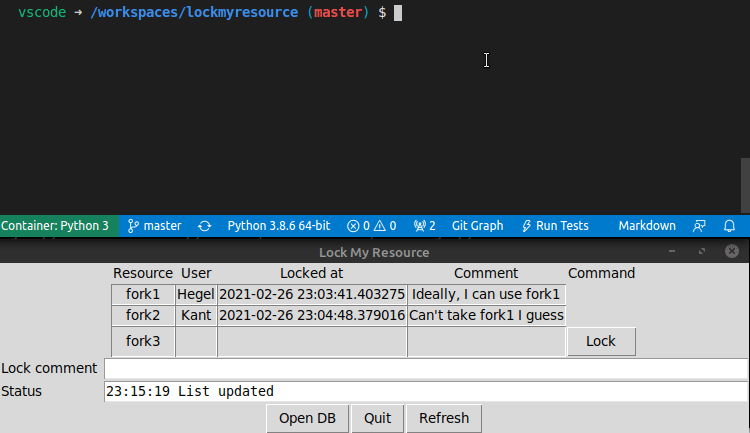

# lockmyresource
Coordinate locking resources for humans and machines, using a simple sqlite DB

There is a CLI for machines and admins and a minimal tk GUI for lock&release.

## Quick demo


## Usage
```
usage: lockmyresource [-h] [--dbfile DBFILE] [--debug] {list,lock,release} ...

Lock some resources

positional arguments:
  {list,lock,release}  Commands
    list               List resources
    lock               Lock a resource
    release            Release a resource

optional arguments:
  -h, --help           show this help message and exit
  --dbfile DBFILE      Database to use
  --debug
```

> **NOTE** that the current user's username will be used for all operations.

> **NOTE** the db will be created if it does not yet exist

### List resources
```
usage: lockmyresource list [-h] [--format {text,csv,json}]
```

#### Sample output
```
$ lockmyresource list
Resource User  Locked_at                  Comment
fork1    Hegel 2021-01-17 11:42:36.459921 Ideally, I can use fork1
fork2    Kant  2021-01-17 11:52:13.768924 Can't take fork1, I guess
spoon    None  None                       None
```

### Lock existing / Create new resource and lock it
```
usage: lockmyresource lock [-h] resource comment
```

>**NOTE** that the comment is mandatory.

>**NOTE** that deletion of resources is not yet implemented, you need to manipulate the sqlite DB manually for now

#### Example
```
$ lockmyresource lock fork1 'To eat or not to eat...'
Obtained lock for Resource(name='fork1')
```

### Release a lock
```
usage: lockmyresource release [-h] resource
```

> **NOTE** That only the locking user can release a lock.

#### Example
```
$ lockmyresource release fork1
Released lock for Resource(name='fork1')
```

### Wait for a lock to be released
```
usage: lockmyresource subscribe resource [shell-command]
```

> **NOTE** Will not wait if it is the current user who has locked the resource

#### Examples
```
$ lockmyresource subscribe fork1 && aplay tada.wav

$ lockmyresource subscribe fork2 'start trigger.bat' --interval=10
```